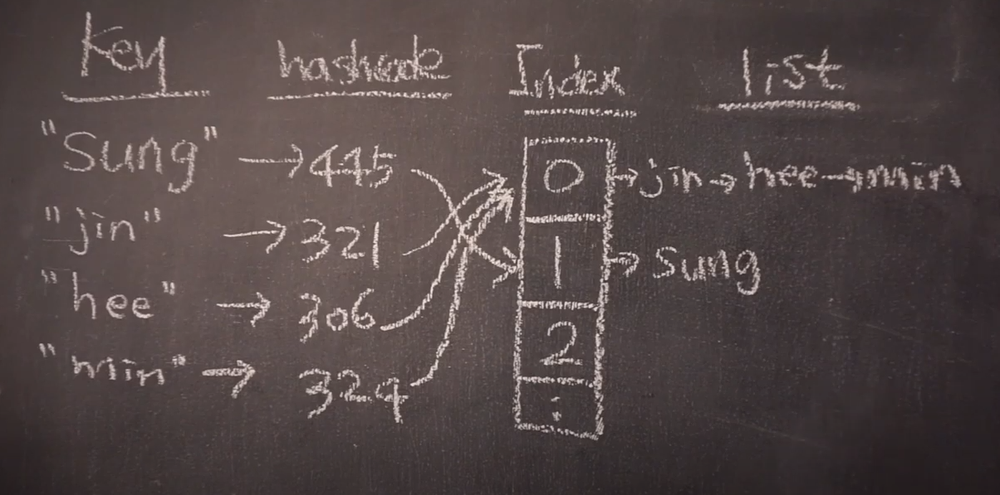

# Hash


# 1. 배경

이전 자료구조에서 자료구조 안에 있는 특정 값을 찾기 위해서 arrayList는 배열의 위치(Index)를, LinkedList는 노드를 순회해서 해당 값을 찾았다.

ArrayList는 접근은 빨랐지만 데이터 추가 삭제시 각 값을 이동시켜야 하므로 시간이 많이 걸렸고, LinkedList는 데이터 추가 삭제는 빨랐지만 조회할때 순회하는데 시간이 많이 걸렸다.

데이터 접근은 ArrayList 처럼 인덱스로 바로 하면서 삽입 삭제시 LinkedList 처럼 하는 자료구조가 있다면 되지 않을까? 데이터를 찾을때 인덱스로 바로 찾으려면 인덱스와 데이터 사이의 관계가 있어야 한다.  데이터를 자료구조에서 사용되는 인덱스로 만드는 것을 도와주는 것이 Hash 이다.

# 2. Hash 란 무엇인가?

---

해쉬는 임의의 길이를 갖는 데이터(Key)를 해쉬 함수를 통해 고정된 길이의 데이터(digest)로 매핑하는것이다.

해시함수가 동일하다면 환경에 상관없이 동일한 키라면 동일한 다이제스트를 만든다. 이 다이제스트를 배열(hash table)의 주소(index)로 변환시켜 사용한다.

배열은 한정적이기 때문에 다른 해시코드 값이더라도 같은 인덱스를 가질 수 있다. 이런 경우를 충돌(Collision) 이라고 한다. 이런 경우는 배열 내부는 LinkedList로 되어 있기 때문에 LinedList에 추가해주면 된다.

즉, array로 주소를 찾고 node로 데이터를 추가 삭제 하는 것이다.



때문에 잘 만들어진 해시 함수는(최선) 데이터가 배열에 골고루 퍼져서 바로 찾으니 시간 복잡도가 O(1) 이고, 한 인덱스에 데이터가 다 몰릴 경우(최악)는 배열안의 LinkedList에서 데이터를 찾아야 하니 시간 복잡도가 O(n)이 된다.

해시의 성능에 영향을 주는 요인은 용량과 부하율 이 두가지다. 용량은 해시 테이블에 있는 배열의 크기이며 초기 용량은 단순히 해시 테이블이 생성된 시점의 용량이다. 부하율은 해시 테이블의 용량이 자동으로 증가하기 전에 해시 테이블이 얼마나 가득 차도록 허용되는지를 측정한 것이다. 해시 테이블의 항목 수가 로드 팩터와 현재 용량의 곱을 초과하면 해시 테이블이 약 2배의 버킷 수를 갖도록 해시 테이블을 다시 해시(즉, 내부 데이터 구조를 재구성)합니다.

ex) 자바 컬렉션 프레임워크 HashMap 1.2버전의 값으로 설명해보자면

- 디폴트 초기 용량은 16
- 디폴트 부하율을 0.75

이므로  해시 테이블의 항목수가 16 x 0.75 = 12 가 초과하면 용량수가 32이가 되도록 해시 테이블을 다시 만든다.

# 3. HashTable 과 HashMap

---

HashTable 과 HashMap 둘다 키와 값 쌍을 해쉬 테이블에 저장한다. 그렇다면 이 둘의 차이는 무엇일까. 자바 컬랙션 프레임워크의 HashMap 클래스의 설명에서 이 차이에 대해서 설명한다.

```java
/*
	Hash table based implementation of the Map interface. This implementation provides all of the optional map operations, and permits null values and the null key. (The HashMap class is roughly equivalent to Hashtable, except that it is unsynchronized and permits nulls.)

	...

	Note that this implementation is not synchronized. If multiple threads access a hash map concurrently, and at least one of the threads modifies the map structurally, it must be synchronized externally.

	...

*/
public class HashMap<K,V> extends AbstractMap<K,V>
    implements Map<K,V>, Cloneable, Serializable {
	
	...
	
	static final int DEFAULT_INITIAL_CAPACITY = 1 << 4; // aka 16

	...

}
```

## 3.1 null 사용 유무

HashTable은 null 이 아닌 모든 객체를 key 와 value 로 사용

HashMap은 null 도 허용

## 3.2 멀티 스레드 유무

HashTable 은 멀티 스레드를 지원

HashMap은 멀티 스레드 미지원

## 3.3 상속의 차이

Hashtable은 Dictionary Legacy 클래스를 확장하지만 다시 엔지니어링되어 이제 Map 인터페이스도 구현합니다.

HashMap 클래스는 Map 인터페이스를 구현하고 AbstractMap 클래스를 확장합니다.

## 3.4 초기 용량

Hashtable은 11

HashMap은 16

## 3.5 결론

HashMap은 Hashtable의 고급 버전 및 개선 사항이다. 멀티 스레드를 사용하지 않는다면 스레드 대기가 필요 없어 더 빠른 HashMap을 권장한다.

# 4.직접 구현

---

java 1.1 의 HashMap 을 보고 핵심적인 메서드만 구현해보겠다.

[https://docs.oracle.com/javame/config/cdc/ref-impl/fp1.1.2/jsr219/java/util/HashMap.html](https://docs.oracle.com/javame/config/cdc/ref-impl/fp1.1.2/jsr219/java/util/HashMap.html)